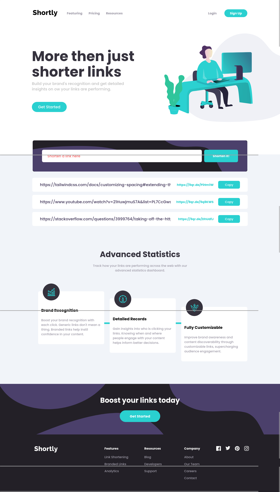

# Frontend Mentor - Shortly URL shortening API Challenge solution

This is a solution to the [Shortly URL shortening API Challenge challenge on Frontend Mentor](https://www.frontendmentor.io/challenges/url-shortening-api-landing-page-2ce3ob-G). Frontend Mentor challenges help you improve your coding skills by building realistic projects.

## Table of contents

- [Overview](#overview)
  - [The challenge](#the-challenge)
  - [Screenshot](#screenshot)
  - [Links](#links)
- [My process](#my-process)
  - [Built with](#built-with)
  - [What I learned](#what-i-learned)
  - [Continued development](#continued-development)
  - [Useful resources](#useful-resources)
- [Author](#author)
- [Acknowledgments](#acknowledgments)

## Overview

### The challenge

Users should be able to:

- View the optimal layout for the site depending on their device's screen size
- Shorten any valid URL
- See a list of their shortened links, even after refreshing the browser
- Copy the shortened link to their clipboard in a single click
- Receive an error message when the `form` is submitted if:
  - The `input` field is empty

### Screenshot

### Links

- Solution URL: [Add solution URL here](https://github.com/ttsoares/urlshorter)
- Live Site URL: [Add live site URL here](https://urlshorter-beta.vercel.app/)

## My process

### Built with

- Flexbox
- CSS Grid
- Mobile-first workflow
- [React](https://reactjs.org/) - JS library
- [Next.js](https://nextjs.org/) - React framework
- [React Hook Form](https://www.npmjs.com/package/react-hook-form) - Fine grain form management
- [tailwindcss/forms](https://www.npmjs.com/package/@tailwindcss/forms) - Provides a basic reset for form styles

### What I learned

- A lot of exercises about relative/absolute CSS positioning.
- How to really control SVGs properties with Tailwind classes.

### Continued development

- Again this solution is not a "fluid design", it really only looks good at 1440px and 375px. It would be a scary challenge to make it nice in all resolutions...

### Useful resources

- Documentation of the React Hook Form was very helpful.

## Author

- Website - [Thomas Tschoepke Soares](https://www.linkedin.com/in/thomas-soares-6791781b/)
- Frontend Mentor - [@ttsoares](https://www.frontendmentor.io/profile/ttsoares)

## Acknowledgments

- A lot of reading in the TailwindCSS documentation !
